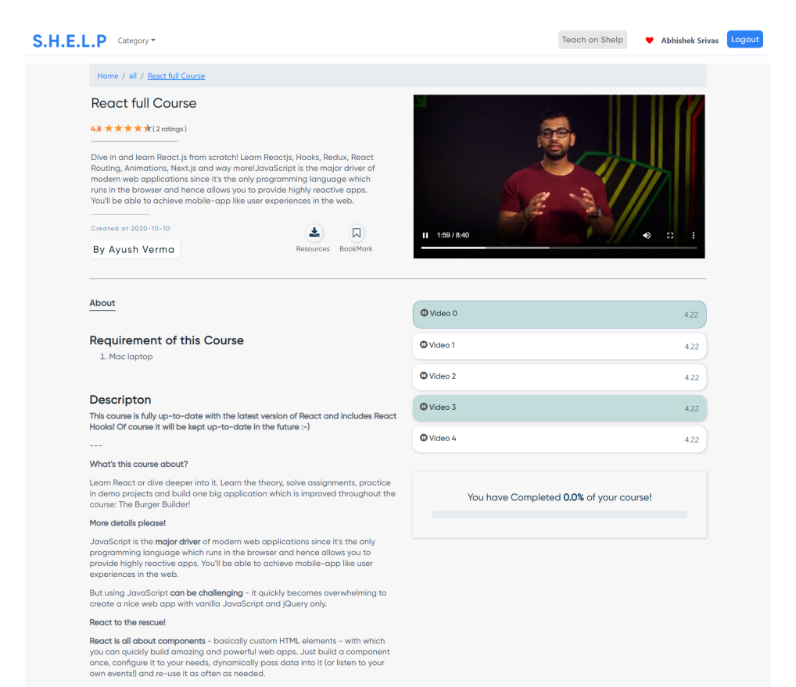
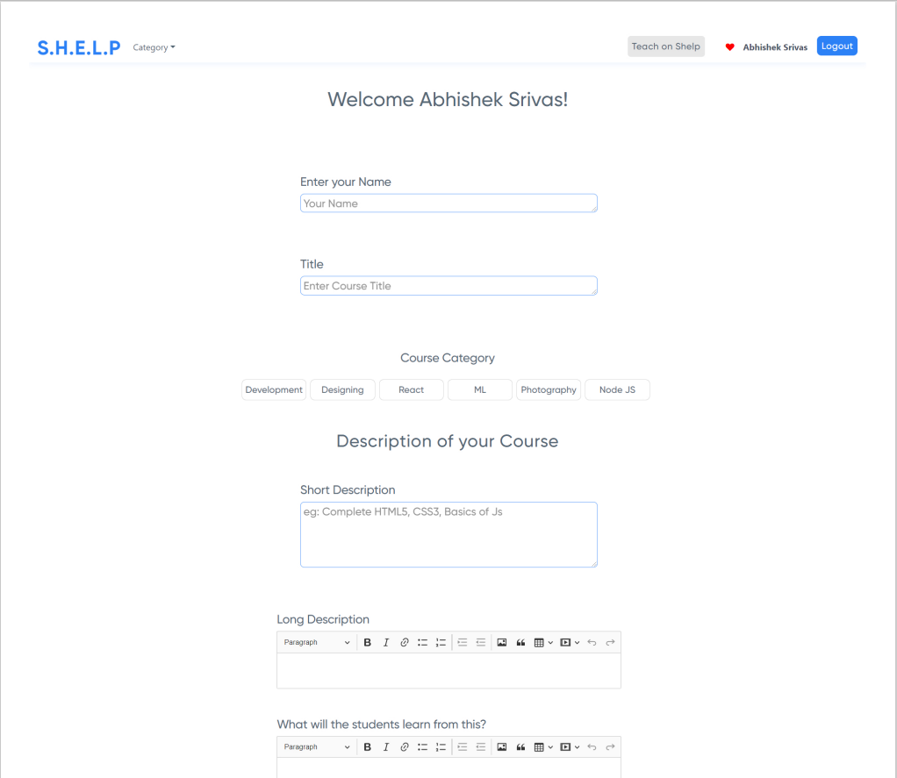
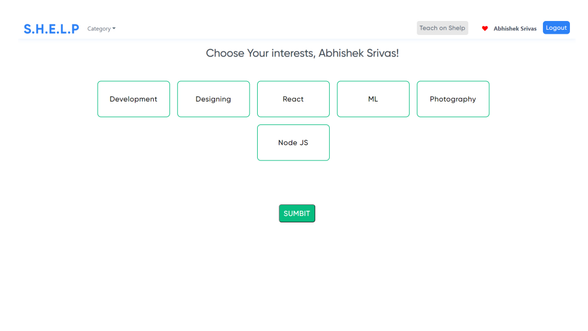
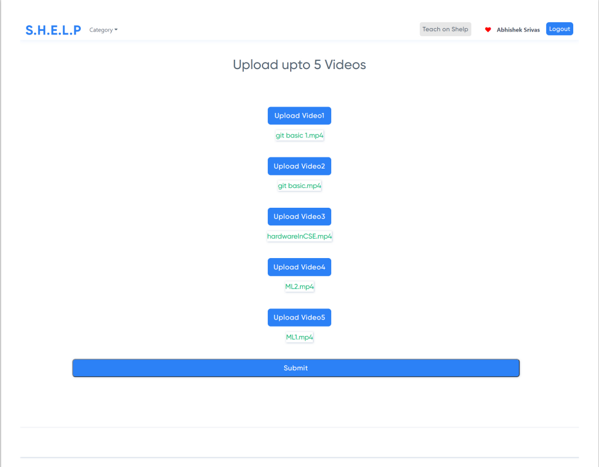

# S.H.E.L.P
##### It is a fully responsive Ed Tech made using React.js as Frontend and Node.js as backend and has all of its features from uploading courses as a teacher to watching them like students and it has features of bookarking, Rating, Suggestions, Pdf download.

### Features

#### Student
- [x] Proper Authentication system with signup,login,otp verification,resend otp,forgot password (fully validated with bootstrap alerts)
- [x] Homepage with courses being fetched categorically
- [x] Recommended Courses based on user's preferences
- [x] Rating of Courses
- [x] Bookmarked Courses where users can remove or add bookmark
- [x] Download resourses (pdf - notes)
- [x] Responsive React Video player for videos
- [x] Progress bar 
- [x] CoursePage with all the content of the course

#### Teacher
- [x] Proper Authentication system with signup,login,otp verification,resend otp,forgot password (fully validated with bootstrap alerts)
- [x] Fully validated teacher uploading form with descriptition,title,Image and other details
- [x] CkEditor for writing in textbox with abilities to add diffrent headings,paragraphs,bold,italics,link,tables,sizes etc
- [x] Teacher can upload upto 5 videos with upload bar to show progress
- [x] Teacher can see their uploaded courses
- [x] Teacher can delete their course
- [x] Teacher can edit their course

   ---
   Signup Page

  

 ---
  Homepage
 

 ---
Course Page
 

 ---
 Teacher Uploading Form
 

 ---
 Preference Page
 

 ---
Uploading Videos

